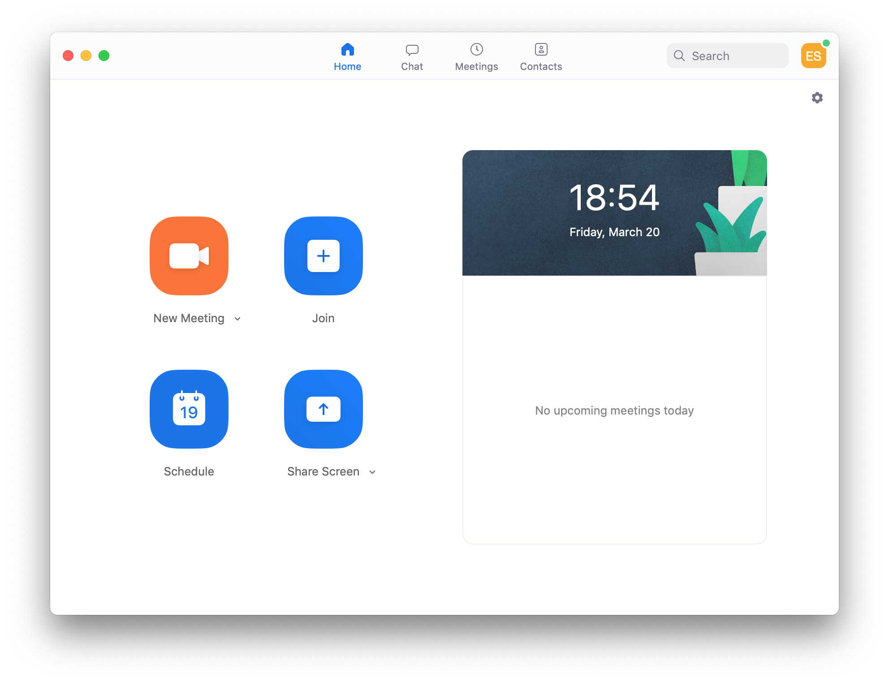
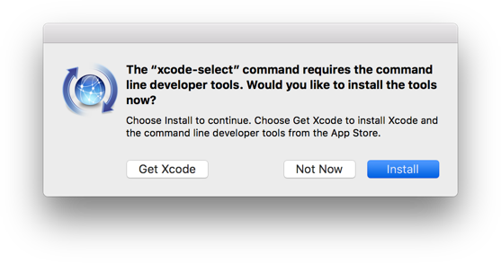

# 电脑设置教程

以下的教程将会帮助你为接下来在[Le Wagon](http://www.lewagon.org) 全栈开发训练营中做好准备：

- 获取一个文本编辑器，这里将会是你日日夜夜花时间的地方
- 安装一个软件包管理器
- 装扮你的终端
- 配置git和GitHub
- 安装Ruby

## 远程工具

为了能让我们不在一起的时候也能很好的沟通，我们将会使用以下两个工具：

### Zoom

⚠️ 如果你已经安装了Zoom，请确保你Zoom的版本不低于**5.4**。否则，你将不能使用分组讨论室来和你的伙伴一起工作。

Zoom是一个视频会议工具。想要创建账户并安装这个应用，你需要到[https://zoom.us/download](https://zoom.us/download)这个网页，并在**Zoom会议客户端（Zoom Client for Meetings）**下方点击**下载（Download）**按钮。打开你刚下载好的文件。将出现一个进度条，然后Zoom便会开始。点击**Connection** 并创建一个账户，选择**Sign Up Free**选项：


当你连接成功后，你将会看到:



现在你可以关闭Zoom了。


## 检查你的电脑是否为Apple Silicon(Apple M1芯片)

如果你是在2020下半年买的电脑，它更有可能是Apple Silicon而不是Intel处理器。让我们来查看查看...

你可以从Applications > Utilities或者在[Spotlight](https://support.apple.com/en-gb/HT204014)里面搜索：


复制粘贴以下的指令到终端里并按`Enter`来执行这段指令。

``` bash
/bin/bash -c "$(curl -fsSL https://raw.githubusercontent.com/lewagon/setup/master/utils/osx_list_processor_type.sh)"
```

☝️执行完这段代码之后将会表明你的电脑是否使用的是Apple Silicon。

如果你的电脑使用的是Apple Silicon，展开下面的段落并进行阅读。如果不是的话，请忽略它。

<details>
  <summary>👉&nbsp;&nbsp;Setup for Apple Silicon 👈</summary>

  &nbsp;


## Apple Silicon的相关设置

### 卸载Homebrew

我们需要卸载Homebrew以防本地已经安装了一个版本。

在终端中执行以下代码:

``` bash
/bin/bash -c "$(curl -fsSL https://raw.githubusercontent.com/Homebrew/install/HEAD/uninstall.sh)"
```

如果brew如果没有被安装，你将会得到以下消息`brew: command not found!`

### 为Rosetta配置终端

打开访达Finder（或者在[Spotlight](https://support.apple.com/en-gb/HT204014)里搜索它)。

前往Applications > Utilities.

复制终端应用(选择它, 然后Cmd + C, Cmd + V)，并将它的复制重命名为Terminal Rosetta。

在Terminal Rosetta软件上按Cmd + I, 然后勾选”使用Rosetta打开（Open using Rosetta）“.

⚠️ 从此以后在训练营中，每当你需要打开终端的时候，你将需要打开**Terminal Rosetta**应用。

启动终端应用程序。将会跳出安装Rosetta窗口。点击安装。

</details>

## 一个有关在mac上跳出应用程序的小贴士

在mac上点击应用程序窗口左上方的小红叉**并不是真正的退出了它**，他只是关闭了一个活跃窗口。如果想要 _真正_ 的退出应用程序，你需要在应用活跃的时候按`Cmd + Q`，或者在你的菜单栏里前往`APP_NAME` -> 点击`Quit`


在这个设置教程中，你将会被要求**退出并重启**应用程序很多次，请确保你可以正确的退出重启 :pray:

## 命令行工具

从Applications > Utilities或者[Spotlight](https://support.apple.com/en-gb/HT204014)搜索，打开一个新的终端窗口。

复制粘贴以下指令到你的终端并按下`Enter`来执行指令。

```bash
xcode-select --install
```

如果你收到了以下消息，你可以直接就跳过这一步并前往下一步。

```
# command line tools are already installed, use "Software Update" to install updates
```

不然的话，他将会打开一个窗口询问你是否想要下载一些软件。同意并等待。如果失败了，在重新尝试一下`xcode-select --install`这个指令，有的时候Apple服务器会过载。



当你下载的时候，你可以继续前往GitHub账户的设置，但是要在Homebrew章节前**停下来**。你将需要安装好的命令行工具来执行那一章节。

如果你收到了以下消息，你需要更新软件更新目录。

```
Xcode is not currently available from the Software Update server
```

如果遇到这种情况的话，你需要复制粘贴以下指令并按下Enter。

```bash
sudo softwareupdate --clear-catalog
```

这个执行结束之后，你可以尝试再一次安装（复制粘贴以下指令并按下Enter）。

```bash
xcode-select --install
```

然后你便可以继续接下来的教程啦。


## GitHub账户


