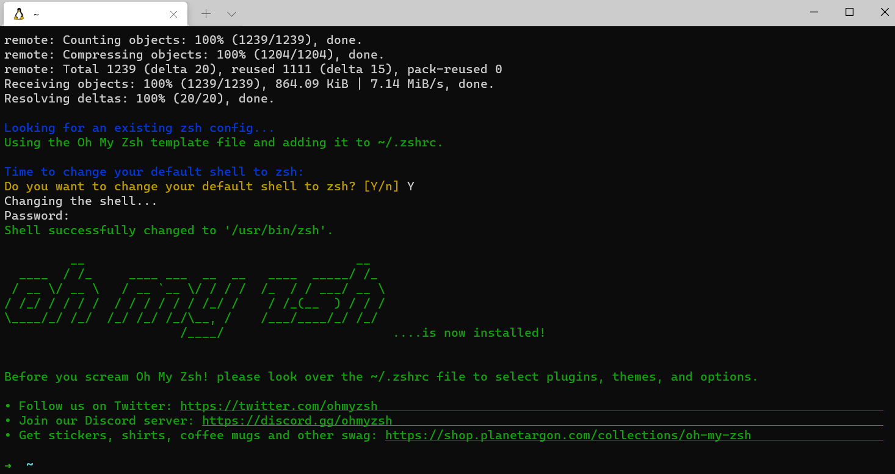

# 电脑设置教程

以下的教程将会帮助你为接下来在[Le Wagon](http://www.lewagon.org) 全栈开发训练营中做好准备：

- 获取一个文本编辑器，这里将会是你日日夜夜花时间的地方
- 安装一个软件包管理器
- 装扮你的终端
- 配置git和GitHub
- 安装Ruby


## GitHub账户

你有注册好GitHub账户嘛？如果还没有，[现在注册](https://github.com/join)。

:point_right: **[上传一张照片](https://github.com/settings/profile)** 并在你的GitHub账户中设置你的名称。这一步很重要，因为我们将使用一个带有你头像的内部dashboard。请**现在**立即做这一步，然后再去继续下面的步骤。


## 检查你的电脑是否为Apple Silicon(Apple M1芯片)

如果你是在2020下半年买的电脑，它更有可能是Apple Silicon而不是Intel处理器。让我们来查看查看...

你可以从Applications > Utilities或者在[Spotlight](https://support.apple.com/en-gb/HT204014)里面搜索：


复制粘贴以下的指令到终端里并按`Enter`来执行这段指令。

``` bash
/bin/bash -c "$(curl -fsSL https://raw.githubusercontent.com/lewagon/setup/master/utils/macos_list_processor_type.sh)"
```

☝️执行完这段代码之后将会表明你的电脑是否使用的是Apple Silicon。

如果你的电脑使用的是Apple Silicon，展开下面的段落并进行阅读。如果不是的话，请忽略它。

<details>
  <summary>👉&nbsp;&nbsp;Setup for Apple Silicon 👈</summary>

  &nbsp;


## Apple Silicon的相关设置

### 卸载Homebrew

我们需要卸载Homebrew以防本地已经安装了一个版本。

在终端中执行以下代码:

``` bash
/bin/bash -c "$(curl -fsSL https://raw.githubusercontent.com/Homebrew/install/HEAD/uninstall.sh)"
```

如果brew如果没有被安装，你将会得到以下消息`brew: command not found!`

### 为Rosetta配置终端

打开访达Finder（或者在[Spotlight](https://support.apple.com/en-gb/HT204014)里搜索它)。

前往Applications > Utilities.

复制终端应用(选择它, 然后Cmd + C, Cmd + V)，并将它的复制重命名为Terminal Rosetta。

在Terminal Rosetta软件上按Cmd + I, 然后勾选”使用Rosetta打开（Open using Rosetta）“.

⚠️ 从此以后在训练营中，每当你需要打开终端的时候，你将需要打开**Terminal Rosetta**应用。

启动终端应用程序。将会跳出安装Rosetta窗口。点击安装。

</details>


## 一个有关在mac上跳出应用程序的小贴士

在mac上点击应用程序窗口左上方的小红叉**并不是真正的退出了它**，他只是关闭了一个活跃窗口。如果想要 _真正_ 的退出应用程序，你需要在应用活跃的时候按`Cmd + Q`，或者在你的菜单栏里前往`APP_NAME` -> 点击`Quit`


在这个设置教程中，你将会被要求**退出并重启**应用程序很多次，请确保你可以正确的退出重启 :pray:

## 命令行工具

从Applications > Utilities或者[Spotlight](https://support.apple.com/en-gb/HT204014)搜索，打开一个新的终端窗口。

复制粘贴以下指令到你的终端并按下`Enter`来执行指令。

```bash
xcode-select --install
```

如果你收到了以下消息，你可以直接就跳过这一步并前往下一步。

```
# command line tools are already installed, use "Software Update" to install updates
```

不然的话，他将会打开一个窗口询问你是否想要下载一些软件。同意并等待。如果失败了，在重新尝试一下`xcode-select --install`这个指令，有的时候Apple服务器会过载。


当你下载的时候，你可以继续前往GitHub账户的设置，但是要在Homebrew章节前**停下来**。你将需要安装好的命令行工具来执行那一章节。

如果你收到了以下消息，你需要更新软件更新目录。

```
Xcode is not currently available from the Software Update server
```

如果遇到这种情况的话，你需要复制粘贴以下指令并按下Enter。

```bash
sudo softwareupdate --clear-catalog
```

这个执行结束之后，你可以尝试再一次安装（复制粘贴以下指令并按下Enter）。

```bash
xcode-select --install
```

然后你便可以继续接下来的教程啦。


## Homebrew

在Mac上，你需要安装[Homebrew](http://brew.sh/)，一个包管理工具。我们将在安装一些软件的时候用到它。

想要安装，你需要打开终端并执行：

```bash
/bin/bash -c "$(curl -fsSL https://web-dev-challenge-lewagon-image.oss-cn-shanghai.aliyuncs.com/setup/install_hb.sh)"
```

这将会询问你的确认（按下`Enter`）并输入你的**macOS用户账户密码**（那个当你重启你Macbook时，用来[登入](https://support.apple.com/en-gb/HT202860) 的密码）。
:warning:当你在终端输入密码的时候，你将**看不到**任何视觉反馈（类似`*****`），这是**正常的**！直接输入密码并按下`Enter`来确认。

如果你已经有了Homebrew,终端会告诉你的。那么一切正常，你可以继续接下来的步骤。

接下来，让我们安装一些有用的软件：

```bash
brew update
```

如果你得到了`/usr/local must be writable`的报错，直接运行以下指令：

```bash
sudo chown -R $USER:admin /usr/local
brew update
```

无论是否有这行报错，继续执行下方的指令（你可以一次性直接复制/粘贴下方所有行）

```bash
brew upgrade git         || brew install git
brew upgrade gh          || brew install gh
brew upgrade wget        || brew install wget
brew upgrade imagemagick || brew install imagemagick
brew upgrade jq          || brew install jq
brew upgrade openssl     || brew install openssl
```


## macOS Terminal Theme

在Mac上，打开`Terminal > Preferences`并在`Profiles`中将“Pro”主题设置为默认。


**退出**并重启终端。它现在会有一个好看的黑色背景，对眼睛会更友好。

:bulb: 如果你想尝试其他主题的话，网上有许多可用的主题，比如[MaterialDark](https://github.com/lysyi3m/macos-terminal-themes#materialdark-download)。换主题的部分你可以在你其他设置都设置好后，回头继续做。请先继续Github的设置！


## Oh-my-zsh

Let's install the `zsh` plugin [Oh My Zsh](https://ohmyz.sh/).

In a terminal execute the following command:

```bash
sh -c "$(curl -fsSL https://raw.github.com/ohmyzsh/ohmyzsh/master/tools/install.sh)"
```

If asked "Do you want to change your default shell to zsh?", press `Y`

At the end your terminal should look like this:



:heavy_check_mark: If it does, you can continue :+1:

:x: Otherwise, please **ask for a teacher**


## GitHub CLI

CLI是[Command-line Interface（命令行界面）](https://baike.baidu.com/item/%E5%91%BD%E4%BB%A4%E8%A1%8C%E7%95%8C%E9%9D%A2/9910197?fr=aladdin)的首字母缩写。

在这一章节里面，我们会安装[GitHub CLI](https://cli.github.com/)。这样我们就可以从终端链接GitHub的数据，执行一些有用的动作。

之前执行的命令应该已经安装了GitHub CLI。首先你需要**登陆**。复制下面的命令（**不要**更改它），然后复制到终端，敲击回车：

```bash
gh auth login -s 'user:email' -w
```

你会看到下面的输出结果：

```bash
- Logging into github.com
! First copy your one-time code: 0EF9-D015
- Press Enter to open github.com in your browser...
```

复制那段验证码（code）(在上面的例子中是`0EF9-D015` ），然后敲击`Enter`。你的浏览器就会打开一个页面让你授权GitHub CLI使用你的GitHub账号。同意，并等待一会儿。回到终端，再次敲击`回车`，然后就应该好啦:tada:

检查一下你有没有链接好：

```bash
gh auth status
```

如果你看到`Logged in to github.com as <你的GitHub用户名> `，那就可以了。如果没有，**问问老师**。

然后运行下面的配置命令:

```bash
gh config set git_protocol ssh
```

最后，新建一个[gist](https://docs.github.com/en/free-pro-team@latest/github/writing-on-github/editing-and-sharing-content-with-gists)来确保`gh` 可以正常运作：

```bash
echo "Hello [Le Wagon](https://www.lewagon.com) :wave:" | gh gist create -d "Starting my coding journey..." -f "SETUP_DAY.md" -p -w
```

这一行命令会在你的浏览器里打开刚创建的gist页面。看呐，我们刚创建了一个[**Markdown**](https://guides.github.com/features/mastering-markdown/)文件！


## GitHub

我们需要生成SSH密钥。这些会在GitHub和Heroku上使用。把它当成一种登陆的方式好了，但它和平时用的用户名和密码不一样。如果你之前有生成过密钥，你就可以跳过这个步骤。

打开终端，然后输入下面的命令，把email换成**你自己的**（应该用你注册GitHub的email）。然后它会提示你一些信息。按回车键，直到它问你要**密码**。

```bash
mkdir -p ~/.ssh && ssh-keygen -t ed25519 -o -a 100 -f ~/.ssh/id_ed25519 -C "TYPE_YOUR_EMAIL@HERE.com"
```

**敲黑板：** 当它问你要密码时，输入你想要的密码（并且是你可以记住的密码）。这个密码会保护你保存在硬盘上的私钥。你输入的时候，还是不会在屏幕上看到任何东西，这是**正常的！**输入密码，当你输完的时候，按下回车。

然后你需要把**公钥**存到GitHub上。运行下面的命令：

```bash
cat ~/.ssh/id_ed25519.pub
```

它会在屏幕上显示`id_ed25519.pub`文件的内容。


- 复制出现在`ssh`的内容（公钥）粘贴到你邮箱地址的末尾
- 打开[github.com/settings/ssh](https://github.com/settings/ssh)
- 点击绿色的按钮`New SSH key`
- 填你的电脑的名称 （可以自己取一个，比如`My Windows`）
- 粘贴**公钥**
- 点击绿色按钮**Add key**，就完成这个步骤了


再检查一下，在终端里运行：

```bash
ssh -T git@github.com
```

:warning: 它会显示一个警告提示，输入`yes`，然后敲击`Enter`。

这个是应该看到的结果:

```
# Hi --------! You've successfully authenticated, but GitHub does not provide shell access
```

&nbsp;

&nbsp;&nbsp;&nbsp; :heavy_check_mark: 如果你看到这条信息，那说明密钥已经被成功加上了！

&nbsp;&nbsp;&nbsp; :x: 如果你看到错误提示，你需要重新试试。别忘了你可以*叫老师来帮忙*。


---

#### :wrench: 故障排查

<details>
  <summary>如果<code>ssh -T git@github.com</code> 不行的话</summary>

  &nbsp;


  运行下面的命令，然后再尝试一遍:

  ```bash
  ssh-add ~/.ssh/id_ed25519
  ```
  </details>

---


别着急，花点时间看看[这篇文章](http://sebastien.saunier.me/blog/2015/05/10/github-public-key-authentication.html)来更好地了解那些密钥都是干什么用的。


## Dotfiles (标准配置)

黑客很喜欢把他们的shell和工具变得很酷炫。

让我们用Le Wagon提供的一个超棒的默认配置文件来开始吧：[`lewagon/dotfiles`](http://github.com/lewagon/dotfiles).

因为你的配置是私人的，所以你需要保存在**自己**的代码库里（repository/repo）。Fork的意思是：在你的GitHub账号上建一个新的代码库，和原始的那一个是一模一样的（可以想象成你在复制粘贴这个代码库）。
这样，你在你的GitHub上就会有一个新的代码库： `$GITHUB_USERNAME/dotfiles`。
我们需要fork，因为每个人都需要在那些文件里加上一些**特定**信息（比如你的名字）。

打开终端，运行下面的命令：

```bash
export GITHUB_USERNAME=`gh api user | jq -r '.login'`
echo $GITHUB_USERNAME
```

你就能看到你的GitHub用户名在终端里显示出来了。
如果没有的话，现在就**停下**，找老师帮忙。看起来之前的步骤(`gh auth`)有一些问题。

现在就可以fork代码库（repo)，然后克隆到你自己的电脑上了：

```bash
mkdir -p ~/code/$GITHUB_USERNAME && cd $_
gh repo fork lewagon/dotfiles --clone
```

运行`dotfiles`安装器：

```bash
cd ~/code/$GITHUB_USERNAME/dotfiles && zsh install.sh
```

用下面的命令检查一下你GitHub账号录入的电子邮箱。你需要在其中选一个（如果你有好几个的话），然后再进入下一个步骤：

```bash
gh api user/emails | jq -r '.[].email'
```

运行git安装器：

```bash
cd ~/code/$GITHUB_USERNAME/dotfiles && zsh git_setup.sh
```

:point_up: 这会**提示**填写你的全名（`FirstName LastName`）和你的邮箱。注意啦，你**需要**填`gh api ...`命令列出的其中一个电子邮箱。不然，Kitt就没办法跟进你的学习进程。

现在**退出**你刚打开的所有终端窗口。


### Sublime Text 自动配置

打开一个新的终端并输入：

```bash
cd ~/code
stt
```

它将会**在Sublime Text中打开当前文件夹**。这是我们如何使用它的方法。

**关闭Sublime Text**并重新打开它：

```bash
stt
```

**等待一分钟**，等所有额外的软件包都自动安装好（会自动打开一个带有文本的新的窗口，上面会包含每个你安装好的新包的文档）。如果想要跟踪软件包的安装进度，你可以前往`View > Show console`。

如果想要核查是否所有的插件都安装好了，你可以打开`命令面板 Command Palette`(在OSX上，按下`⌘` + `⇧` + `P`；在linux上，按下`Ctrl` + `⇧` + `P`)，输入`Packlist`然后按`Enter`，你应该会看到有一些软件包被安装了（像是[Emmet](http://emmet.io/)）。

当这些结束之后，你可以关闭Sublime Text。


## 安装Ruby (使用[rbenv](https://github.com/sstephenson/rbenv))

首先，我们需要先清理我们之前可能安装过的Ruby:

```bash
rvm implode && sudo rm -rf ~/.rvm
# 如果出现"zsh: command not found: rvm"报错, 继续后续的步骤. 这是指 `rvm` is not
# 如果出现"zsh: command not found: rvm"报错, 继续后续的步骤. 这是指 你的电脑上没有安装`rvm`
# 这是我们想要的！

sudo rm -rf $HOME/.rbenv /usr/local/rbenv /opt/rbenv /usr/local/opt/rbenv
```

现在让我们来通过Homebrew来获取[`rbenv`](https://github.com/rbenv/rbenv)和[`ruby-build`](https://github.com/rbenv/ruby-build)，他们将会很有用。

```bash
brew uninstall --force rbenv ruby-build
```

然后退出**所有你打开着的终端窗口**（Cmd + Q)并重启新的一个。然后运行：

```bash
brew install rbenv
```

再一次，退出所有你的终端窗口并重启。


现在，你已经准备好了去安装最新Ruby版本并把它设置为默认版本。

运行下方这个指令，它会**花费一些时间（5-10分钟）**

```bash
rbenv install 2.7.3
```

当Ruby安装好后，运行下面这个指令来告诉系统使用2.7.3这个版本作为默认版本。

```bash
rbenv global 2.7.3
```

然后再次**重启**你的终端（关掉并重新打开它）。

```bash
ruby -v
```

你应该会看到`ruby 2.7.3p`。如果没有的话，询问一下老师。

## 安装一些gems

---

<details>
  <summary>点击这里，如果你在 :cn: <bold>中国</bold>的话</summary>


  &nbsp;

  :warning: 如果你在中国的话，你应该使用以下命令来安装gem。

```bash
# China only!
gem sources --remove https://rubygems.org/
gem sources -a https://gems.ruby-china.com/
gem sources -l
# *** CURRENT SOURCES ***
# https://gems.ruby-china.com/
# Ruby-china.com must be in the list now
```
</details>

---

无论你是不是在中国，请都运行下面的指令：

```bash
gem install rake bundler rspec rubocop rubocop-performance pry pry-byebug colored http
```

如果你遇到了以下的报错：

`
ERROR: While executing gem ... (TypeError)
incompatible marshal file format (can't be read)
format version 4.8 required; 60.33 given
`

运行以下的指令：

```bash
rm -rf ~/.gemrc
```

然后，重新运行安装gems的指令。

**永远不要**使用`sudo gem install`来安装一个gem！即使你偶然发现了一个网络上的答案（或者终端提示）叫你这么做。


## Node (使用[nvm](https://github.com/nvm-sh/nvm))

```bash
curl -o- https://web-dev-challenge-lewagon-image.oss-cn-shanghai.aliyuncs.com/setup/install_nvm.sh | zsh
```

重启你的终端并执行下方指令：

```bash
nvm -v
```

你应该会看到你的nvm的版本。如果没有的话，问一下你的老师。

现在，让我们来安装node：

```bash
nvm install 14.15.0
```

当这个指令执行结束之后，运行：

```bash
node -v
```

你应该会看到`v14.15.0`。如果没有的话，问一下你的老师。


## yarn

让我们一起来安装[`yarn`](https://classic.yarnpkg.com/en/docs/install):

```bash
npm install --global yarn
```

重启终端并运行：

```bash
yarn -v
```

你应该会看到你yarn的版本。如果没有的话，问一下你的老师。


## PostgreSQL

几周之后，我们会学习SQL和数据库。你将会需要一个叫做PostgreSQL的东西，一个开源的可用于生产环境的强大数据库。让我们现在一起安装它。

```bash
brew install postgresql
brew services start postgresql
```

当你结束了上方的指令之后，让我们一起来核查一下它是否安装成功了：

```bash
psql -d postgres
```

如果你进入到了一个像下方这个，一个新的输入框的话，那么说明你的PostgreSQL已经安装好啦！

```bash
psql (12.5)
Type "help" for help.

postgres=#
```

如果想要退出它的话，输入`\q`然后按下`Enter`。


## 最后检查

让我们来看看你是否已经成功安装好了所有软件。

退出所有的终端，打开一个新的终端窗口并运行下方指令：

```bash
curl -Ls https://web-dev-challenge-lewagon-image.oss-cn-shanghai.aliyuncs.com/setup/check.rb > _.rb && ruby _.rb || rm _.rb
```

它应该会告诉你，你的工作台是否已经正确的设置好了 ：）如果没有的话，问一下你的老师。


## 校友
:warning: 如果你已经收到了一封来自Le Wagon邀请你去注册Kitt(我们的学习平台)的邮件并且你也注册完成了的话，你可以安全的跳过这一章节。如果你还没有注册完成的话，请跟随邮件里的教程，完成注册。

如果你不确定你要做什么，可以查看[这个链接](https://kitt.lewagon.com/)。如果你已经登录了的话，你可以跳过这个章节。如果你没有登录的话，你需要点击`Enter Kitt as a Student`。如果你可以成功的登录，你也可以安全的跳过这一步。不然的话，你可以询问一下老师你是否有收到过相关的邮件，或者直接跟着执行下面的教程。

前往[kitt.lewagon.com/onboarding](http://kitt.lewagon.com/onboarding)，注册成为Le Wagon的一名校友。选择你的batch，用gitHub账户登录并填写你的信息。

你的老师将会验证你的确属于这个batch。你可以在完成了注册表单后去询问老师去做验证。

当你的老师验证成功后，请前往你的邮箱收件箱。你应该会有两封邮件：

- 一封来自Slack,邀请你加入Le Wagon Alumni Slack社群（在这儿你可以与你的伙伴和所有之前的学员交流）。点击**Join**并填写相应的个人信息。

- 一封来自GitHub,要求你加入`lewagon`团队。**接受它**，不然的话你将没有办法看到有关讲座和课程的文件。


## Slack

在Mac App Store上[下载](https://itunes.apple.com/fr/app/slack/id803453959?mt=12)Slack的本地应用并注册进入`lewagon-alumni`的组织。

确保你在上面上传了照片。

你也可以在你的iPhone或者Android设备上登录Slack!

这么做的意义是，你可以一直开着Slack，于是你就可以分享有用的链接/寻求帮助/决定哪儿里吃饭/等等。

至于远程的ticket，你将可以用Slack语音或者视频电话来获取帮助。为了确保所有都可以正常工作，在你的电脑上启动Slack应用程序，然后[跟着这里的步骤](https://slack.com/intl/en-gb/help/articles/115003538426-Troubleshoot-Slack-Calls#run-our-calls-test)（tl;dr 输入`/call --test`然后在任何的channel里按下`Enter`键）。

等测试结束之后，你应该至少会在麦克风和相机处，看到绿色“All clear”消息。如果没有的话，问一下你的老师。


## 键盘

当你成为了一名程序员的时候，你将明白离开键盘去操作将会耗费大量的时间，所以你将会想最大化的减少花费在触控盘和鼠标的时间。以下是一些在OSX上的小技巧可以帮助你做到这些：

### 键盘速度

前往  > 系统偏好设置 > 键盘。设置`Key Repeat`到最快的位置（最右边）并将`Delay Until Repeat`移到最短的位置（最右边）。

### 全部键盘权限

前往  > 系统偏好设置 > 键盘。点击第三个标签页（Shortcuts）。在窗体的底部，点击`All controls`单选按钮。这样的话，当你遇见一个带有多个选项的对话窗的时候，你可以按`Enter`来确认，或者按`Space`来选择取消选项。如果你遇到超过两个选项的对话窗，你可以按tab键来切换选择。

### 黑客的macOS

[阅读这个脚本](https://github.com/mathiasbynens/dotfiles/blob/master/.macos)然后挑选一些你认为适合你的指令。例如，您可以在终端中输入以下内容：

```bash
# 默认情况下扩展保存面板
defaults write NSGlobalDomain NSNavPanelExpandedStateForSaveMode -bool true
defaults write NSGlobalDomain PMPrintingExpandedStateForPrint -bool true
defaults write NSGlobalDomain PMPrintingExpandedStateForPrint2 -bool true

# 将截屏保存到桌面（或其他位置）
defaults write com.apple.screencapture location "${HOME}/Desktop"

# etc..
```


conclusion.md


