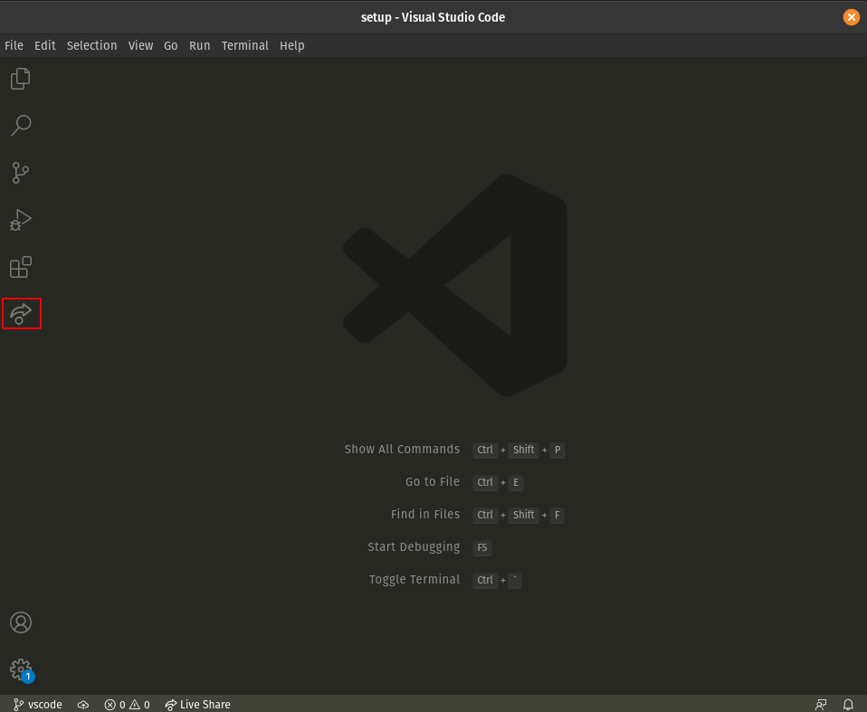
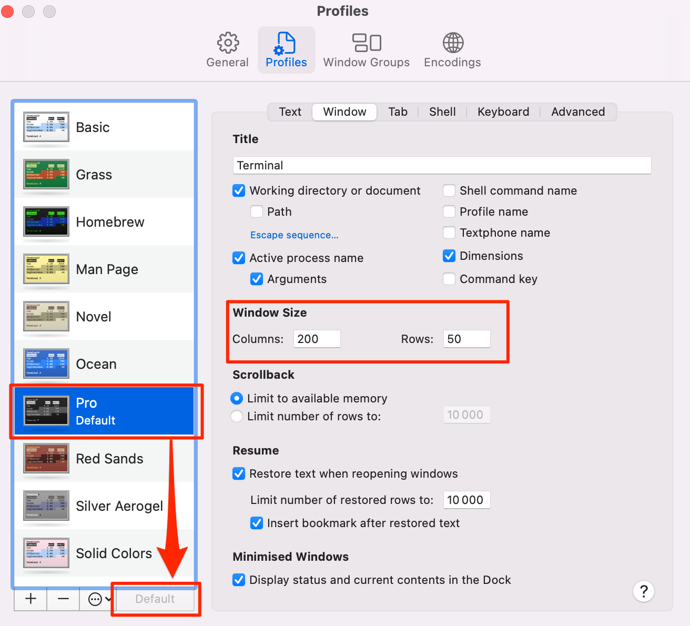
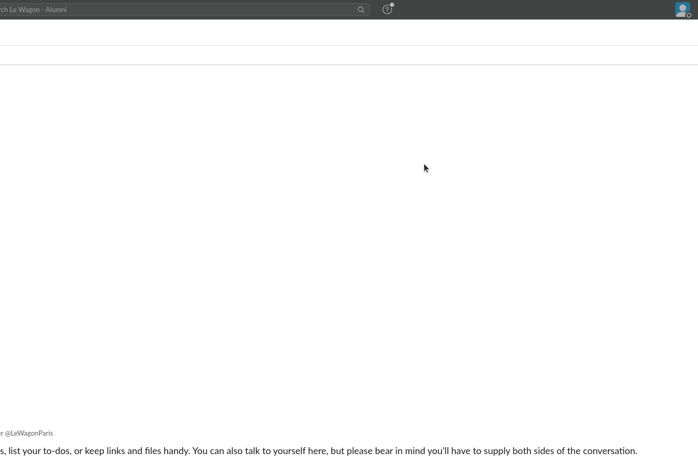
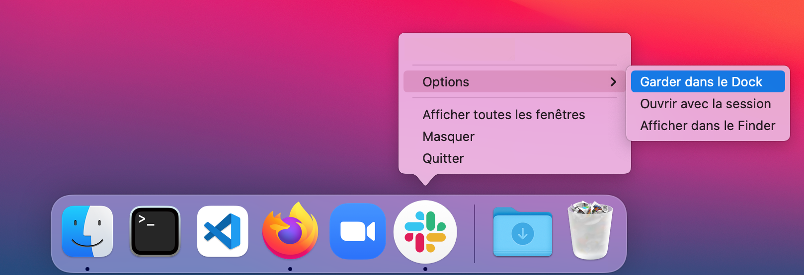

# Setup instructions

You will find below the instructions to set up you computer for [Le Wagon Web Development course](https://www.lewagon.com/web-development-course/full-time)

Please **read them carefully and execute all commands in the following order**. If you get stuck, don't hesitate to ask a teacher for help :raising_hand:

Let's start :rocket:


## Zoom

To be able to interact when we are not in the same physical room, we will be using [Zoom](https://zoom.us/), a video conferencing tool.

:warning: If you already have Zoom installed, please make sure that the version is at least **5.6**.

- Go to [https://zoom.us/download](https://zoom.us/download)
- Under **Zoom Client** click the **Download** button
- Open the file you have just downloaded to install the app
- Open the Zoom app
- If you already have a Zoom account, sign in using your credentials
- If not, click on the **Sign Up Free** link:


You will be redirected to Zoom's website to complete a form.

When it's done, go back to the Zoom app and sign in using your credentials.

You should then see a screen like this:


You can now close the Zoom app.


## GitHub account

Have you signed up to GitHub? If not, [do it right away](https://github.com/join).

:point_right: **[Upload a picture](https://github.com/settings/profile)** and put your name correctly on your GitHub account. This is important as we'll use an internal dashboard with your avatars. Please do this **now**, before you continue with this guide.


## Apple Silicon Chips

If you bought your computer after late 2020, chances are it has a new Apple silicon chip instead of an Intel processor: let's find out.

Open a new terminal window from Applications > Utilities or search for it with [Spotlight](https://support.apple.com/en-gb/HT204014):


Copy-paste the following command in the terminal and hit `ENTER` to execute.

``` bash
/bin/bash -c "$(curl -fsSL https://raw.githubusercontent.com/lewagon/setup/master/utils/macos_list_processor_type.sh)"
```

☝️ The result of the command should indicate whether your computer uses Apple Silicon.

If your computer uses Apple Silicon, expand the paragraph below and go through it. Otherwise ignore it.

<details>
  <summary>👉&nbsp;&nbsp;Setup for Apple Silicon 👈</summary>

### Uninstall Homebrew

We need to uninstall Homebrew in case a native version was installed.

Execute the following command in the terminal:

``` bash
/bin/bash -c "$(curl -fsSL https://raw.githubusercontent.com/Homebrew/install/HEAD/uninstall.sh)"
```

If brew was not installed you will get the message `brew: command not found!`

### Configure Terminal for Rosetta

Open the Finder app (or search for it with [Spotlight](https://support.apple.com/en-gb/HT204014)).

Go to Applications > Utilities.

Duplicate the terminal app (select it, then `CMD` + `C`, `CMD` + `V`), and rename a copy as Terminal Rosetta.

Press `CMD` + `I` on the Terminal Rosetta app, then check the box "Open using Rosetta".

⚠️ From now on during the bootcamp, whenever you are asked to open a Terminal, you will use the **Terminal Rosetta** app.

Launch the Terminal app. You will be prompted to install Rosetta. Click Install.

</details>


## A note about quitting apps on a Mac

Clicking the little red cross in the top left corner of the application window on a Mac **does not really quit it**, it just closes an active window. To quit the application _for real_ either press `CMD + Q` when the application is active, or navigate to `APP_NAME` -> `Quit` in the menu bar.


During this setup you will be asked to **quit and re-open** applications multiple times, please make sure you do it properly :pray:

## Command Line Tools

Open a new terminal, copy-paste the following command and hit `ENTER`:

```bash
xcode-select --install
```

If you receive the following message, you can just skip this step and go to next step.

```bash
# command line tools are already installed, use "Software Update" to install updates
```

Otherwise, it will open a window asking you if you want to install some software: click on "Install" and wait.


:heavy_check_mark: If you see the message "The software was installed" then all good :+1:

:x: If the command `xcode-select --install` fails try again: sometimes the Apple servers are overloaded.

:x: If you see the message "Xcode is not currently available from the Software Update server", you need to update the software update catalog:

```bash
sudo softwareupdate --clear-catalog
```

Once this is done, you can try to install again.


## Homebrew

Homebrew](http://brew.sh/) is a package manager: it's a software used to install other software from the command line. Let's install it!

Open a terminal and run:

```bash
/bin/bash -c "$(curl -fsSL https://raw.githubusercontent.com/Homebrew/install/HEAD/install.sh)"
```

This will ask for your confirmation (hit `ENTER`) and your **macOS user account password** (the one you use to [log in](https://support.apple.com/en-gb/HT202860) when you reboot your Macbook).

:warning: When you you type your password, nothing will show up on the screen, **that's normal**. This is a security feature to mask not only your password as a whole but also its length. Just type your password and when you're done, press `ENTER`.

If you already have Homebrew, it will tell you so, that's fine, go on.

Then install some useful software:

```bash
brew update
```

If you get a `/usr/local must be writable` error, just run this:

```bash
sudo chown -R $USER:admin /usr/local
brew update
```

Error message or not, proceed running the following in the terminal (you can copy / paste all the lines at once).

```bash
brew upgrade git         || brew install git
brew upgrade gh          || brew install gh
brew upgrade wget        || brew install wget
brew upgrade imagemagick || brew install imagemagick
brew upgrade jq          || brew install jq
brew upgrade openssl     || brew install openssl
```


## Visual Studio Code

### Installation

Let's install [Visual Studio Code](https://code.visualstudio.com) text editor.

Copy (`CMD` + `C`) the command below then paste it in your terminal (`CMD` + `V`):

```bash
brew install --cask visual-studio-code
```

Then launch VS Code by running the following command in your terminal:

```bash
code
```

:heavy_check_mark: If a VS Code window has just opened, you're good to go :+1:

:x: Otherwise, please **contact a teacher**


## VS Code Extensions

### Installation

Let's install some useful extensions to VS Code.

Copy-paste the following commands in your terminal:

```bash
code --install-extension ms-vscode.sublime-keybindings
code --install-extension emmanuelbeziat.vscode-great-icons
code --install-extension MS-vsliveshare.vsliveshare
code --install-extension rebornix.ruby
code --install-extension dbaeumer.vscode-eslint
```

Here is a list of the extensions you are installing:
- [Sublime Text Keymap and Settings Importer](https://marketplace.visualstudio.com/items?itemName=ms-vscode.sublime-keybindings)
- [VSCode Great Icons](https://marketplace.visualstudio.com/items?itemName=emmanuelbeziat.vscode-great-icons)
- [Live Share](https://marketplace.visualstudio.com/items?itemName=MS-vsliveshare.vsliveshare)
- [Ruby](https://marketplace.visualstudio.com/items?itemName=rebornix.Ruby)
- [ESLint](https://marketplace.visualstudio.com/items?itemName=dbaeumer.vscode-eslint)


### Live Share configuration

[Visual Studio Live Share](https://visualstudio.microsoft.com/services/live-share/) is a VS Code extension which allows you to share the code in your text editor for debugging and pair-programming: let's set it up!

Launch VS Code from your terminal by typing `code` and pressing `ENTER`.

Click on the little arrow at the bottom of the left bar :point_down:



- Click on the "Share" button, then on "GitHub (Sign in using GitHub account)".
- A popup appears asking you to sign in with GitHub: click on "Allow".
- You are redirected to a GitHub page in you browser asking you to authorize Visual Studio Code: click on "Continue" then "Authorize github".
- VS Code may display additional pop-ups: close them by clicking "OK".

That's it, you're good to go!


## macOS Terminal Theme

Launch a terminal, click on `Terminal > Preferences` and set the "Pro" theme as default profile.



**Quit and restart** your terminal: it should now have a nice black background, easier on the eyes.


## Oh-my-zsh

Let's install the `zsh` plugin [Oh My Zsh](https://ohmyz.sh/).

In a terminal execute the following command:

```bash
sh -c "$(curl -fsSL https://raw.github.com/ohmyzsh/ohmyzsh/master/tools/install.sh)"
```

If asked "Do you want to change your default shell to zsh?", press `Y`

At the end your terminal should look like this:


:heavy_check_mark: If it does, you can continue :+1:

:x: Otherwise, please **ask for a teacher**


## SSH Key

### Generation

We need to generate SSH keys which are going to be used by GitHub to authenticate you. You can think of it as a way to log in, but different from the well known username/password pair.

If you already generated keys that you already use with other services, you can skip this step.

Open a terminal and copy-paste this command, replacing the email with **yours** (the same one you used to create your GitHub account).

```bash
mkdir -p ~/.ssh && ssh-keygen -t ed25519 -o -a 100 -f ~/.ssh/id_ed25519 -C "TYPE_YOUR_EMAIL@HERE.com"
```

It will prompt for information. Just press enter until it asks for a **passphrase**.

:warning: When asked for a passphrase, put something you want and that you'll remember. It's a password to protect your private key stored on your hard drive.

:warning: When you you type your passphrase, nothing will show up on the screen, **that's normal**. This is a security feature to mask not only your passphrase as a whole but also its length. Just type your passphrase and when you're done, press `ENTER`.

### Giving your public key to GitHub

Now, you will give your **public** key to GitHub.

In your terminal copy-paste the following command:

```bash
cat ~/.ssh/id_ed25519.pub
```

It will prompt on the screen the content of the `id_ed25519.pub` file.

- Copy that text from `ssh` to the end of your email address
- Go to [github.com/settings/ssh](https://github.com/settings/keys)
- Click on the green button `New SSH key`
- Fill in the Title with your computer name (`Macbook Pro` for instance)
- Paste the **key**
- Finish by clicking on the **Add SSH key** green button.

To check that this step is completed, in the terminal run this.

```bash
ssh -T git@github.com
```

:warning: You will be prompted a warning, type `yes` then `ENTER`.

This is the expected result:

```
# Hi --------! You've successfully authenticated, but GitHub does not provide shell access
```

:heavy_check_mark: If you got this message, the key was added to GitHub successfully :+1:

:x: If you encountered an error, you will have to try again. Do not hesitate to **contact a teacher**.

<details>
  <summary>If <code>ssh -T git@github.com</code> does not work</summary>

  Try running this command before trying again:

  ```bash
  ssh-add ~/.ssh/id_ed25519
  ```
</details>


## GitHub CLI

CLI is the acronym of [Command-line Interface](https://en.wikipedia.org/wiki/Command-line_interface).

In this section, we will install [GitHub CLI](https://cli.github.com/) to perform useful actions with GitHub data directly from the terminal.

It should already be installed on your computer from the previous commands.

First in order to **login**, copy-paste the following command in your terminal:

:warning: **DO NOT edit the `email`**

```bash
gh auth login -s 'user:email' -w
```

You will get the following output:

```bash
! First copy your one-time code: 0EF9-D015
- Press Enter to open github.com in your browser...
```

Select and copy the code (`0EF9-D015` in the example), then press `ENTER`.

Your browser will open and ask you to authorize GitHub CLI to use your GitHub account. Accept and wait a bit.

Come back to the terminal, press `ENTER` again, and that's it.

To check that you are properly connected, type:

```bash
gh auth status
```

:heavy_check_mark: If you get `Logged in to github.com as <YOUR USERNAME> `, then all good :+1:

:x: If not, **contact a teacher**.

Then run the following configuration line:

```bash
gh config set git_protocol ssh
```


## Dotfiles (Standard configuration)

Hackers love to refine and polish their shell and tools.

We'll start with a great default configuration provided by Le Wagon: [`lewagon/dotfiles`](https://github.com/lewagon/dotfiles).

As your configuration is personal, you need your **own** repository storing it. So you will **fork** Le Wagon repository.

Forking means that you will create a new repo in your own GitHub account `$GITHUB_USERNAME/dotfiles`, identical to the original Le Wagon one that you will be able to modify at will.

Open your terminal and run the following commands:

```bash
export GITHUB_USERNAME=`gh api user | jq -r '.login'`
echo $GITHUB_USERNAME
```

:heavy_check_mark: You should see your GitHub username printed.

:x: If not, **stop here** and ask for help. There may be a problem with the previous step (`gh auth`).

Time to fork the repo and clone it on your computer:

```bash
mkdir -p ~/code/$GITHUB_USERNAME && cd $_
gh repo fork lewagon/dotfiles --clone
```

Run the `dotfiles` installer:

```bash
cd ~/code/$GITHUB_USERNAME/dotfiles
zsh install.sh
```

Check the emails registered with your GitHub Account. You'll need to pick one at the next step:

```bash
gh api user/emails | jq -r '.[].email'
```

Run the `git` installer:

```bash
cd ~/code/$GITHUB_USERNAME/dotfiles && zsh git_setup.sh
```

:point_up: This will **prompt** you for your name (`FirstName LastName`) and your email.

:warning: You **need** to put one of the email listed above thanks to the previous `gh api ...` command. If you don't do that, Kitt won't be able to track your progress.

Please now **quit** all your opened terminal windows.


## rbenv

Let's install [`rbenv`](https://github.com/sstephenson/rbenv), a software to install and manage `ruby` environments.

First, we need to clean up any previous Ruby installation you might have:

```bash
rvm implode && sudo rm -rf ~/.rvm
# If you got "zsh: command not found: rvm", carry on. It means `rvm` is not
# on your computer, that's what we want!

sudo rm -rf $HOME/.rbenv /usr/local/rbenv /opt/rbenv /usr/local/opt/rbenv
```

:warning: This command may prompt for your password.

:warning: When you you type your password, nothing will show up on the screen, **that's normal**. This is a security feature to mask not only your password as a whole but also its length. Just type your password and when you're done, press `ENTER`.

Then in the terminal, run:

```bash
brew uninstall --force rbenv ruby-build
```

Then quit **all your opened terminal windows** (`CMD` + `Q`) and restart one. Then run:

```bash
brew install rbenv
```


## Ruby

### Installation

Now, you are ready to install the latest [ruby](https://www.ruby-lang.org/en/) version and set it as the default version.

Run this command, it will **take a while (5-10 minutes)**

```bash
rbenv install 2.7.3
```

Once the ruby installation is done, run this command to tell the system
to use the 2.7.3 version by default.

```bash
rbenv global 2.7.3
```

Then **restart** your terminal again (close it and reopen it).

```bash
ruby -v
```

:heavy_check_mark: If you see something starting with `ruby 2.7.3p` then you can proceed +1:

:x: If not, **ask a teacher**

### Installing some gems

<details>
  <summary>If you are in <bold>China</bold></summary>

  :warning: If you are in China, you should update the way we'll install gem with the following commands.

```bash
# China only!
gem sources --remove https://rubygems.org/
gem sources -a https://gems.ruby-china.com/
gem sources -l
# *** CURRENT SOURCES ***
# https://gems.ruby-china.com/
# Ruby-china.com must be in the list now
```
</details>

In the ruby world, we call external libraries `gems`: they are pieces of ruby code that you can download and execute on your computer. Let's install some!

In your terminal, copy-paste the following command:

```bash
gem install rake bundler rspec rubocop rubocop-performance pry pry-byebug colored http
```

:heavy_check_mark: If you get `xx gems installed`, then all good :+1:

:x: If you encounter the following error:

```bash
ERROR: While executing gem ... (TypeError)
incompatible marshal file format (can't be read)
format version 4.8 required; 60.33 given
```

Run the following command:
```bash
rm -rf ~/.gemrc
```

Rerun the command to install the gems.

:warning: **NEVER** install a gem with `sudo gem install`! Even if you stumble upon a Stackoverflow answer (or the terminal) telling you to do so.


## Node.js

[Node.js](https://nodejs.org/en/) is a JavaScript runtime to execute JavaScript code in the terminal. Let's install it with [nvm](https://github.com/nvm-sh/nvm), a version manager for Node.js.

In a terminal, execute the following command:

```bash
curl -o- https://raw.githubusercontent.com/nvm-sh/nvm/v0.37.0/install.sh | zsh
```

Restart your terminal and run the following:

```bash
nvm -v
```

You should see a version. If not, ask a teacher.

Now let's install node:

```bash
nvm install 14.15
```

When the installation is finished, run:

```bash
node -v
```

:heavy_check_mark: If you see `v14.15`, the installation succeeded :+1:

:x: If not, **contact a teacher**


## yarn

[`yarn`](https://yarnpkg.com/) is a package manager to install JavaScript libraries. Let's install it:

In a terminal, run the following command:

```bash
npm install --global yarn
```

Restart your terminal and run the following command:

```bash
yarn -v
```

:heavy_check_mark: If you a version, you're good :+1:

:x: If not, **ask for a teacher**


## PostgreSQL

In a few weeks, we'll talk about databases and SQL and you'll need something called [PostgreSQL](https://www.postgresql.org/), an open-source robust and production-ready database system.

Let's install it now.

Run the following commands:

```bash
brew install postgresql
brew services start postgresql
```

Once you've done that, let's check that it worked:

```bash
psql -d postgres
```

If you enter a new prompt like this one, you're good!

```bash
psql (13.3)
Type "help" for help.

postgres=#
```

To quit it, type `\q` then `Enter`.


## Check-up

Let's check if you successfully installed everything.

Quit all opened Terminal, open a new one and run the following commands:

```bash
curl -Ls https://raw.githubusercontent.com/lewagon/master/vscode/check.rb > _.rb && ruby _.rb && rm _.rb || rm _.rb
```

:check_mark: If you get a green `Awesome! Your computer is now ready!`, then you're good :+1:

:x: If not, **contact a teacher**.


## Kitt

:warning: If you have received an email from Le Wagon inviting you to sign up on Kitt (our learning platform), you can safely skip this step. Instead, please follow the instructions in the email you received if you haven't done so already.

If you are unsure about what to do, you can follow [this link](https://kitt.lewagon.com/). If you are already logged in, you can safely skip this section. If you are not logged in, click on `Enter Kitt as a Student`. If you manage to login, you can safely skip this step. Otherwise ask a teacher whether you should have received an email or follow the instructions below.

Register as a Wagon alumni by going to [kitt.lewagon.com/onboarding](http://kitt.lewagon.com/onboarding). Select your batch, sign in with GitHub and enter all your information.

Your teacher will then validate that you are indeed part of the batch. You can ask him to do it as soon as you completed the registration form.

Once the teacher has approved your profile, go to your email inbox. You should have 2 emails:

- One from Slack, inviting you to the Le Wagon Alumni slack community (where you'll chat with your buddies and all the previous alumni). Click on **Join** and fill the information.
- One from GitHub, inviting you to `lewagon` team. **Accept it** otherwise you won't be able to access the lecture slides.


## Slack

[Slack](https://slack.com/) is a communcation platform pretty popular in the tech industry.

### Installation

[Download the Slack app](https://itunes.apple.com/fr/app/slack/id803453959?mt=12) and install it.


### Settings

Launch the app and sign in to `lewagon-alumni` organization.

Make sure you **upload a profile picture** :point_down:



The idea is that you'll have Slack open all day, so that you can share useful links / ask for help / decide where to go to lunch / etc.

To ensure that everything is working fine for video calls, let's test your camera and microphone:
- Open the Slack app
- In any channel message bar type `/call --test` and press `ENTER`
- Click on the "Start test" green button


:heavy_check_mark: When the test is finished, you should see green "Succeed" messages at least for your microphone and camera. :+1:

:x: If not, **contact a teacher**.

You can also install Slack app on your phone and sign in `lewagon-alumni`!


## macOS settings

### Security

It is mandatory that you protect your session behind a password.If it is not already the case, go to ` > System Preferences > Users & Groups` and change your account password. You should also go to ` > System Preferences > Security > General`. You should require a password `5 seconds` after sleep or screen saver begins.

You can also go to ` > System Preferences > Mission Control` and click on the `Hot Corners` button at the bottom left. Choose for the bottom right corner to start the screen saver. That way, when you leave your desk, you can quickly lock you screen by putting your mouse in the bottom right corner. 5 seconds after, your Macbook will be locked and will ask for a password to get back on the session.

### Keyboard

As you become a programmer, you'll understand that leaving the keyboard takes a lot of time, so you'll want to minimize using the trackpad or the mouse. Here are a few tricks on macOS to help you do that.

#### Keyboard speed

Go to  > System Preferences > Keyboard. Set `Key Repeat` to the fastest position (to the right) and `Delay Until Repeat` to the shortest position (to the right).

#### Full Keyboard Access

Go to  > System Preferences > Keyboard. Click on the third tab (Shortcuts). At the bottom of the pane, click the radio button `All controls`. This way when you get a dialog with several options, you'll be able to type `ENTER` to confirm, or `SPACE` to choose the cancel option. If you have more than two options, you can use tab to circle between them.

#### macOS For hackers

[Read this script](https://github.com/mathiasbynens/dotfiles/blob/master/.macos) and cherry-pick some stuff you think will suit you. For instance, you can type in the terminal this one:

```bash
# Expanding the save panel by default
defaults write NSGlobalDomain NSNavPanelExpandedStateForSaveMode -bool true
defaults write NSGlobalDomain PMPrintingExpandedStateForPrint -bool true
defaults write NSGlobalDomain PMPrintingExpandedStateForPrint2 -bool true

# Save screenshots to the Desktop (or elsewhere)
defaults write com.apple.screencapture location "${HOME}/Desktop"

# etc..
```

### Pin apps to your dock

You are going to use most of the apps you've installed today really often. Let's pin them to your dock so that they are just one click away!

To pin an app to your dock, launch the app, right-click on the icon in the taskbar to bring up the context menu and choose "Options" then "Keep in Dock".



You must pin:
- Your terminal
- Your file explorer
- VS Code
- Your Internet browser
- Slack
- Zoom


## Setup completed!

Your computer is now all set for [Le Wagon Web Development course](https://www.lewagon.com/web-development-course/full-time) :muscle: :clap:

Enjoy the bootcamp, you will nail it :rocket:


