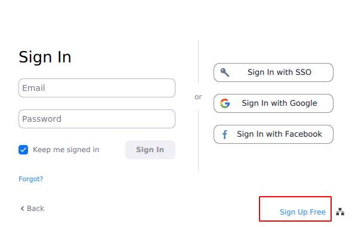
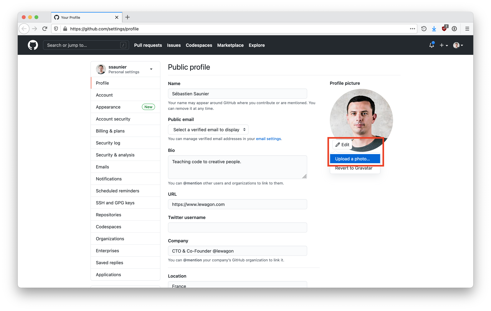
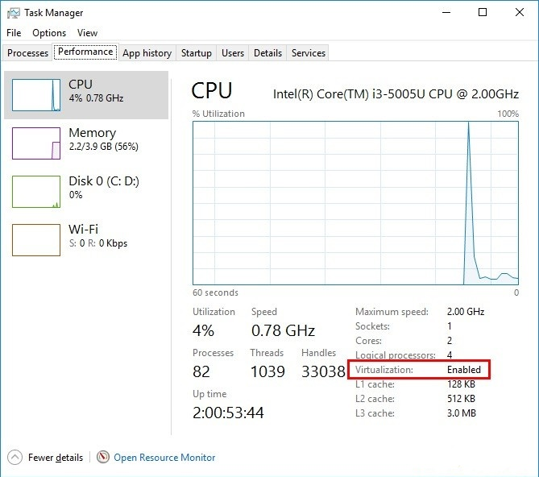
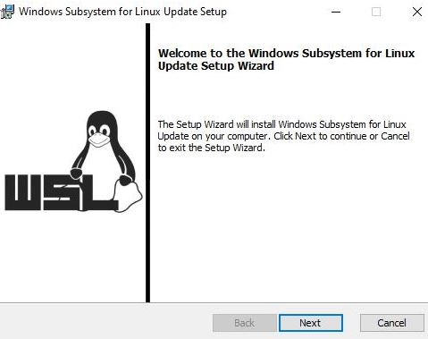
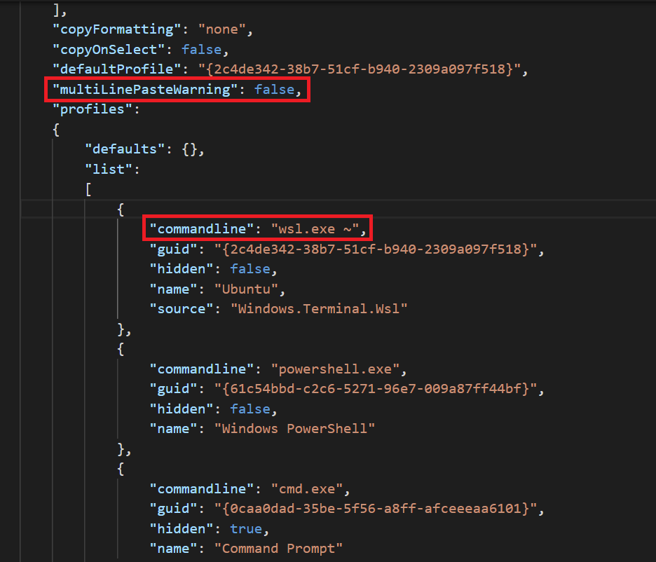
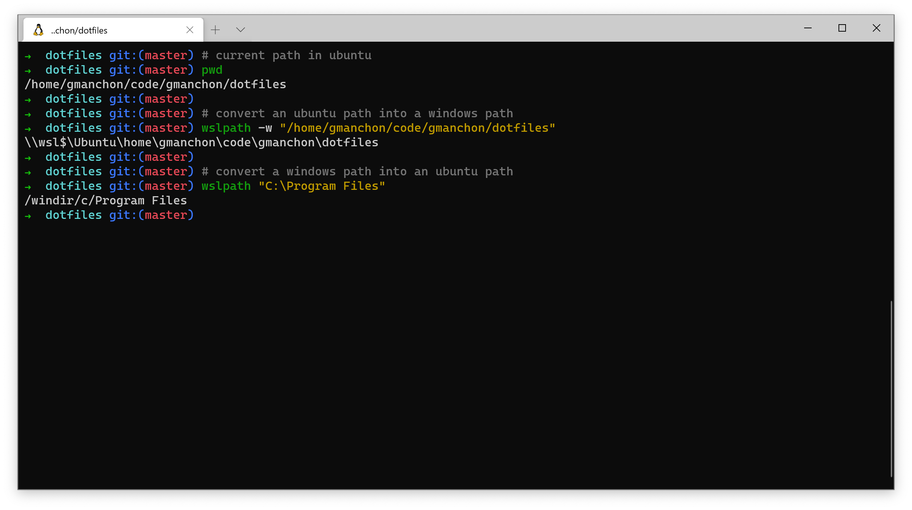

# Setup instructions

You will find below the instructions to set up you computer for [Le Wagon Web Development course](https://www.lewagon.com/web-development-course/full-time)

Please **read them carefully and execute all commands in the following order**. If you get stuck, don't hesitate to ask a teacher for help :raising_hand:

Let's start :rocket:


## Zoom

To be able to interact when we are not in the same physical room, we will be using [Zoom](https://zoom.us/), a video conferencing tool.

:warning: If you already have Zoom installed, please make sure that the version is at least **5.6**.

- Go to [https://zoom.us/download](https://zoom.us/download)
- Under **Zoom Client** click the **Download** button
- Open the file you have just downloaded to install the app
- Open the Zoom app
- If you already have a Zoom account, sign in using your credentials
- If not, click on the **Sign Up Free** link:



You will be redirected to Zoom's website to complete a form.

When it's done, go back to the Zoom app and sign in using your credentials.

You should then see a screen like this:


You can now close the Zoom app.


## GitHub account

Have you signed up to GitHub? If not, [do it right away](https://github.com/join).

:point_right: **[Upload a picture](https://github.com/settings/profile)** and put your name correctly on your GitHub account. This is important as we'll use an internal dashboard with your avatars. Please do this **now**, before you continue with this guide.




## Windows version

Before we start, we need to check that the version of Windows installed on your computer is compatible with this setup instructions.

### Windows 10

To be able to set up your computer, you need to have **Windows 10** installed.

To check your Windows version:
- Press `Windows` + `R`
- Type  `winver`
- Press `Enter`

:heavy_check_mark: If the first words of this window are **Windows 10** you're good to go :+1:

:x: If it does not mention **Windows 10**, you cannot proceed with this setup — but do not panic! You can always upgrade to Windows 10 :relieved:

<details>
  <summary>Upgrade to Windows 10</summary>

  - Download Windows 10 from [Microsoft](https://www.microsoft.com/software-download/windows10ISO)
  - Install it. It should take roughly an hour, but this is dependent on your computer
  - When the installation is over, execute the commands above to check that you now have **Windows 10**
</details>

### Latest updates

Once you're sure that you're using Windows 10, you need to install all the latest updates.

Open Windows Update:
- Press `Windows` + `R`
- Type  `ms-settings:windowsupdate`
- Press `Enter`
- Click on `Check updates`


:heavy_check_mark: If you a green check mark and the message "You're up to date", you're good to go :+1:

:warning: If you have a red exclamation mark and the message "Update available", please install them and repeat the process until it says that you are up to date :loop:

:x: If you have an error message about Windows not being able to apply updates, please **contact a teacher**.

<details>
  <summary>Activate Windows Update Service to fix Updates</summary>

  Some antiviruses and pieces of software deactivate the Update service we need, resulting in the error you see. Let's fix that!
  - Press `Windows` + `R`
  - Type  `services.msc`
  - Press `Enter`
  - Double Click `Windows Update Service`
  - Set its `Startup` to `Automatic`
  - Click on `Start`
  - Click on `Ok`
  Then let's try updates again!
</details>

### Minimum version

Some of the tools we need to install have been release with the `1903` version **or above** of Windows 10 so we need to make sure you have at least this one.

- Press `Windows` + `R`
- Type  `winver`
- Press `Enter`

Check the **Version number**:

:heavy_check_mark: If it says at least `1903`, you are good to go :+1:

:x: If it is below `1903`, please **contact a teacher**.


## Virtualization

We need to ensure that the Virtualization options are enabled in the BIOS of your computer.

For many computers, this is already the case. Let's check:
- Press `Windows` + `R`
- Type  `taskmgr`
- Press `Enter`
- Click on the `Performance` tab
- Click on `CPU`



:heavy_check_mark: If you see "Virtualization: Enabled", you're good to go :+1:

:x: If the line is missing or if the virtualization is disabled, please **contact a teacher before trying to activate the Virtualization**

<details>
  <summary>Activate Virtualization</summary>

  We need to access the BIOS / UEFI of the computer to activate it.
  - Press `Windows + R`
  - Type  `shutdown.exe /r /o /t 1`
  - Press `Enter`
  - Wait for the computer to shutdown
  - Click on `Troubleshoot`
  - Click on `Advanced Options`
  - Click on `UEFI Firmware Settings`
  - Click on `Restart`

  You need to activate the virtualization option for your processor here:
  - Most of the time, in the advanced settings, the CPU settings, or the Northbridge settings
  - The option can be called differently according to your computer:
      - Intel: `Intel VT-x`, `Intel Virtualization Technology`, `Virtualization Extensions`, `Vanderpool`...
      - AMD: `SVM Mode` or `AMD-V`
  - Save the changes after activation and reboot the computer through the appropriate option
</details>


## Windows Subsystem for Linux

### Install WSL 1

WSL is the development environment we are using to run Ubuntu. You can learn more about WSL [here](https://docs.microsoft.com/en-us/windows/wsl/faq).

We will install WSL through the PowerShell Terminal:

:warning: In the following instruction, please be aware of the `Ctrl` + `Shift` + `Enter` key stroke to execute **Windows PowerShell** with administrator privileges instead of just clicking on `Ok`or pressing `Enter`.

- Press `Windows` + `R`
- Type  `powershell`
- Press **`Ctrl` + `Shift` + `Enter`**

:warning: You may have to accept the UAC confirmation about the privilege elevation.

A blue terminal window will appear:

- Copy the following commands one by one (`CTRL` + `C`)
- Paste them into the PowerShell window (`CTRL` + `V` or by right-clicking in the window)
- Run them by pressing `Enter`

```powershell
Enable-WindowsOptionalFeature -Online -FeatureName Microsoft-Windows-Subsystem-Linux
```

```powershell
dism.exe /online /enable-feature /featurename:Microsoft-Windows-Subsystem-Linux /all /norestart
```

```powershell
dism.exe /online /enable-feature /featurename:VirtualMachinePlatform /all /norestart
```

:heavy_check_mark: If all three commands ran without any error, please restart your computer and continue below :+1:

:x: If you encounter an error message (or if you see some text in red in the window), please **contact a teacher**

### Upgrade to WSL 2

Once your computer has restarted, we need to download the WSL2 installer.

- Go to the [download page](https://aka.ms/wsl2kernel)
- Download "WSL2 Linux kernel update package"
- Open the file you've just downloaded
- Click `Next`
- Click `Finish`



:heavy_check_mark: If didn't encounter any error message, you're good to go :+1:

:x: If you encounter the error "This update only applies to machines with the Windows Subsystem for Linux", **right click** on the program and select `uninstall`; you shall be able to install it normally this time.

### Make WSL 2 the default Windows Subsystem for Linux

Now that WSL 2 is installed, let's make it the default version:
- Press `Windows` + `R`
- Type  `cmd`
- Press `Enter`

In the window which appears, type:

```bash
wsl --set-default-version 2
```

:heavy_check_mark: If you see "The operation completed successfully, you can close this terminal and continue below :+1:

:x: If the message you get is about Virtualization, please **contact a teacher**

<details>
  <summary>Enable Virtual Machine Platform Windows feature</summary>

  Follow the steps described [here](https://www.configserverfirewall.com/windows-10/please-enable-the-virtual-machine-platform-windows-feature-and-ensure-virtualization-is-enabled-in-the-bios/#:~:text=To%20enable%20WSL%202,%20Open,Windows%20feature%20on%20or%20off.&text=Ensure%20that%20the%20Virtual%20Machine,Windows%20will%20enable%20WSL%202) until you enable <strong>Virtual Machine Platform</strong> and <strong>Windows Subsystem for Linux</strong>
</details>

<details>
  <summary>Enable Hyper-V Windows feature</summary>

  Follow the steps described [here](https://winaero.com/enable-use-hyper-v-windows-10/) until you enable the group <strong>Hyper-V</strong>
</details>


## Ubuntu

### Installation

- Click on `Start`
- Type  `Microsoft Store`
- Click on the Microsoft Windows Store in the list
- Search for `Ubuntu` in the search bar
- **Select version without any number, just plain "Ubuntu"**
- Click on `Install`

:warning: Don't install **Ubuntu 18.04 LTS** nor **Ubuntu 20.04**!

<details>
  <summary>Uninstall wrong versions of Ubuntu</summary>

  To uninstall a wrong version of Ubuntu, you just have to go to the Installed Program List of Windows 10:

  - Press `Windows` + `R`
  - Type  `ms-settings:appsfeatures`
  - Press `Enter`

  Find the software to uninstall and click on the uninstall button.
</details>

Once the installation is finished, the `Install` button becomes a `Launch` button: click on it.

At first launch, you will be asked some information:
- Choose a **username**:
    - one word
    - lowercase
    - no special characters
    - for example: `lewagon` or your `firstname`
- Choose a **password**
- Confirm your password

:warning: When you you type your password, nothing will show up on the screen, **that's normal**. This is a security feature to mask not only your password as a whole but also its length. Just type your password and when you're done, press `ENTER`.

You can close the Ubuntu window now that it is installed on your computer.

### Check the WSL version of Ubuntu

- Press `Windows` + `R`
- Type  `cmd`
- Press `Enter`

Type the following command:

```bash
wsl -l -v
```

:heavy_check_mark: If the version of Ubuntu WSL is 2, you are good to go :+1:

:x: If the version of Ubuntu WSL is 1, we will need to convert it to version 2.

<details>
  <summary>Convert Ubuntu WSL V1 to V2</summary>

  In the Command Prompt window, type:

  ```bash
  wsl --set-version Ubuntu 2
  ```

  :heavy_check_mark: After a few seconds, you should get the following message: `The conversion is complete`.

  :x: If it does not work, we need to be sure that Ubuntu files are not compressed.
</details>

<details>
  <summary>Check for Uncompressed Files</summary>

  - Press `Windows` + `R`
  - Type  `%localappdata%\Packages`
  - Press `Enter`
  - Open the folder named `CanonicalGroupLimited.UbuntuonWindows...`
  - Right Click on the `LocalState` folder
  - Click on `Properties`
  - Click on `Advanced`
  - Make sure that the option `Compress content` is **not** ticked, then click on `Ok`.

  Apply changes to this folder only and try to convert the Ubuntu WSL version again.

  :x: If the conversion still does not work, please **contact a teacher**.
</details>

You can now close this terminal window.


## Visual Studio Code

### Installation

Let's install [Visual Studio Code](https://code.visualstudio.com) text editor.

- Go to [Visual Studio Code download page](https://code.visualstudio.com/download).
- Click on "Windows" button
- Open the file you have just downloaded.
- Install it with few options:


When the installation is finished, launch VS Code.

### Connecting VS Code to Ubuntu

You should see a frame at the bottom-right corner of VS Code saying it detects WSL. Accept the installation of the WSL extension for VS Code.

:warning: This extension is mandatory for you to be able to work with VS Code!


## Windows Terminal

The standard terminal installed by Ubuntu is a very crude: let's install **Windows Terminal**, a real modern terminal.

### Installation

- Click on `Start`
- Type  `Microsoft Store`
- Click on the Microsoft Windows Store in the list
- Search for `Windows Terminal` in the search bar
- **Select Windows Terminal"**
- Click on `Install`

:warning: DO NOT install **Windows Terminal Preview**, just **Windows Terminal**!

<details>
  <summary>Uninstall wrong version of Windows Terminal</summary>

  To uninstall a wrong version of Windows Terminal, you just have to go to the Installed Program List of Windows 10:

  - Press `Windows` + `R`
  - Type  `ms-settings:appsfeatures`
  - Press `Enter`

  Find the software to uninstall and click on the uninstall button.
</details>

Once the installation is finished, the `Install` button becomes a `Launch` button: click on it.

### Ubuntu as the default terminal

Let's make Ubuntu the default terminal of your Windows Terminal application.

Press `Ctrl` + `,`

It should open the terminal settings:


- Change the default profile to "Ubuntu"
- Click on "Save"
- Click on "Open JSON file"

We have circle in red the part you will change:



First, let's ask Ubuntu to start directly inside your Ubuntu Home Directory instead of the Windows one:
- Locate the `"name": "Ubuntu",`
- Add the following line after it:

```bash
"startingDirectory": "//wsl$/Ubuntu/home/the-username-you-chose-at-the-ubuntu-install",
```
:warning: Do not forget the comma at the end of the line!

:warning: Do not forget to replace the username by your own in the line above!

Then, let's disable warning for copy-pasting commands between Windows and Ubuntu:
- Locate the line `"defaultProfile": "{2c4de342-...}"`
- Add the following line after it:

```bash
"multiLinePasteWarning": false,
```

:warning: Do not forget the comma at the end of the line!

You can save these changes by pressing `CTRL` + `S`

:heavy_check_mark: Your **Windows Terminal** is now setup :+1:

This terminal has tabs: you can choose to open a new terminal tab by clicking on t**+** next to the current one.

**From now on, every time we will refer to the terminal or the console it will be this one.** DO NOT use the Ubuntu app anymore.


## VS Code Extensions

### Installation

Let's install some useful extensions to VS Code.

Copy-paste the following commands in your terminal:

```bash
code --install-extension ms-vscode.sublime-keybindings
code --install-extension emmanuelbeziat.vscode-great-icons
code --install-extension MS-vsliveshare.vsliveshare
code --install-extension rebornix.ruby
code --install-extension dbaeumer.vscode-eslint
```

Here is a list of the extensions you are installing:
- [Sublime Text Keymap and Settings Importer](https://marketplace.visualstudio.com/items?itemName=ms-vscode.sublime-keybindings)
- [VSCode Great Icons](https://marketplace.visualstudio.com/items?itemName=emmanuelbeziat.vscode-great-icons)
- [Live Share](https://marketplace.visualstudio.com/items?itemName=MS-vsliveshare.vsliveshare)
- [Ruby](https://marketplace.visualstudio.com/items?itemName=rebornix.Ruby)
- [ESLint](https://marketplace.visualstudio.com/items?itemName=dbaeumer.vscode-eslint)


### Live Share configuration

[Visual Studio Live Share](https://visualstudio.microsoft.com/services/live-share/) is a VS Code extension which allows you to share the code in your text editor for debugging and pair-programming: let's set it up!

Launch VS Code from your terminal by typing `code` and pressing `ENTER`.

Click on the little arrow at the bottom of the left bar :point_down:


- Click on the "Share" button, then on "GitHub (Sign in using GitHub account)".
- A popup appears asking you to sign in with GitHub: click on "Allow".
- You are redirected to a GitHub page in you browser asking you to authorize Visual Studio Code: click on "Continue" then "Authorize github".
- VS Code may display additional pop-ups: close them by clicking "OK".

That's it, you're good to go!


## Git

### Installation

[`git`](https://git-scm.com/) is a command line software used for version control.

To install `git`:
- Open a terminal
- Copy and paste the following commands:

```bash
sudo apt update
sudo apt install -y git
````

These commands will ask for your password: type it in.

:warning: When you type your password, nothing will show up on the screen, **that's normal**. This is a security feature to mask not only your password as a whole but also its length. Just type in your password and when you're done, press `ENTER`.

### GitHub CLI

Let's now install [GitHub official CLI](https://cli.github.com) (Command Line Interface). It's a software used to interact with your GitHub account via the command line.

In you terminal, copy-paste the following commands and type in your password if asked:

```bash
sudo apt-key adv --keyserver hkp://keyserver.ubuntu.com:80 --recv-key C99B11DEB97541F0
sudo apt-add-repository https://cli.github.com/packages
sudo apt update
```

Then copy-paste the following command:

```bash
sudo apt install -y gh
```

To check that `gh` has been successfully installed on your machine, you can run:

```bash
gh --version
```

:heavy_check_mark: If you see `gh version X.Y.Z (YYYY-MM-DD)`, you're good to go :+1:

:x: Otherwise, please **contact a teacher**


## zsh

Instead of using the default `bash` [shell](https://en.wikipedia.org/wiki/Shell_(computing)), we will use `zsh`.

In a terminal execute the following command and type in your password if asked:

```bash
sudo apt install -y zsh curl vim imagemagick jq
```


## Oh-my-zsh

Let's install the `zsh` plugin [Oh My Zsh](https://ohmyz.sh/).

In a terminal execute the following command:

```bash
sh -c "$(curl -fsSL https://raw.github.com/ohmyzsh/ohmyzsh/master/tools/install.sh)"
```

If asked "Do you want to change your default shell to zsh?", press `Y`

At the end your terminal should look like this:


:heavy_check_mark: If it does, you can continue :+1:

:x: Otherwise, please **ask for a teacher**


## SSH Key

### Generation

We need to generate SSH keys which are going to be used by GitHub to authenticate you. You can think of it as a way to log in, but different from the well known username/password pair.

If you already generated keys that you already use with other services, you can skip this step.

Open a terminal and copy-paste this command, replacing the email with **yours** (the same one you used to create your GitHub account).

```bash
mkdir -p ~/.ssh && ssh-keygen -t ed25519 -o -a 100 -f ~/.ssh/id_ed25519 -C "TYPE_YOUR_EMAIL@HERE.com"
```

It will prompt for information. Just press enter until it asks for a **passphrase**.

:warning: When asked for a passphrase, put something you want and that you'll remember. It's a password to protect your private key stored on your hard drive.

:warning: When you you type your passphrase, nothing will show up on the screen, **that's normal**. This is a security feature to mask not only your passphrase as a whole but also its length. Just type your passphrase and when you're done, press `ENTER`.

### Giving your public key to GitHub

Now, you will give your **public** key to GitHub.

In your terminal copy-paste the following command:

```bash
cat ~/.ssh/id_ed25519.pub
```

It will prompt on the screen the content of the `id_ed25519.pub` file.

- Copy that text from `ssh` to the end of your email address
- Go to [github.com/settings/ssh](https://github.com/settings/keys)
- Click on the green button `New SSH key`
- Fill in the Title with your computer name (`Macbook Pro` for instance)
- Paste the **key**
- Finish by clicking on the **Add SSH key** green button.

To check that this step is completed, in the terminal run this.

```bash
ssh -T git@github.com
```

:warning: You will be prompted a warning, type `yes` then `ENTER`.

This is the expected result:

```
# Hi --------! You've successfully authenticated, but GitHub does not provide shell access
```

:heavy_check_mark: If you got this message, the key was added to GitHub successfully :+1:

:x: If you encountered an error, you will have to try again. Do not hesitate to **contact a teacher**.

<details>
  <summary>If <code>ssh -T git@github.com</code> does not work</summary>

  Try running this command before trying again:

  ```bash
  ssh-add ~/.ssh/id_ed25519
  ```
</details>


## Linking your default browser to Ubuntu

To be sure that you can interact with your browser installed on Windows from your Ubuntu terminal, we need to set it as your default browser there.

:warning: You need to execute at least one of the following commands below:

<details>
  <summary>Google Chrome as your default browser</summary>

  Run the command:

  ```bash
    ls /mnt/c/Program\ Files\ \(x86\)/Google/Chrome/Application/chrome.exe
  ```

  If you get an error like `ls: cannot access...` Run the following command:

  ```bash
    echo "export BROWSER='\"/mnt/c/Program Files/Google/Chrome/Application/chrome.exe\"'" >> ~/.zshrc
  ```

  Else run:

  ```bash
    echo "export BROWSER='\"/mnt/c/Program Files (x86)/Google/Chrome/Application/chrome.exe\"'" >> ~/.zshrc
  ```
</details>

<details>
  <summary>Mozilla Firefox as your default browser</summary>

  Run the command:

  ```bash
    ls /mnt/c/Program\ Files\ \(x86\)/Mozilla\ Firefox/firefox.exe
  ```

  If you get an error like `ls: cannot access...` Run the following command:

  ```bash
    echo "export BROWSER='\"/mnt/c/Program Files/Mozilla Firefox/firefox.exe\"'" >> ~/.zshrc
  ```

  Else run:

  ```bash
    echo "export BROWSER='\"/mnt/c/Program Files (x86)/Mozilla Firefox/firefox.exe\"'" >> ~/.zshrc
  ```
</details>

<details>
  <summary>Microsoft Edge as your default browser</summary>

  Run the command:

  ```bash
  echo "export BROWSER='\"/mnt/c/Program Files (x86)/Microsoft/Edge/Application/msedge.exe\"'" >> ~/.zshrc
  ```
</details>

Restart your terminal.

Then please make sure that the following command returns "Browser defined 👌":

```bash
[ -z "$BROWSER" ] && echo "ERROR: please define a BROWSER environment variable ⚠️" || echo "Browser defined 👌"
```

If it does not,

:heavy_check_mark: If you got this message, you can continue :+1:

:x: If not, choose a browser in the list above and execute the corresponding command. Then don't forget to close your terminal and open it again. Do not hesitate to **contact a teacher**.


## GitHub CLI

CLI is the acronym of [Command-line Interface](https://en.wikipedia.org/wiki/Command-line_interface).

In this section, we will install [GitHub CLI](https://cli.github.com/) to perform useful actions with GitHub data directly from the terminal.

It should already be installed on your computer from the previous commands.

First in order to **login**, copy-paste the following command in your terminal:

:warning: **DO NOT edit the `email`**

```bash
gh auth login -s 'user:email' -w
```

You will get the following output:

```bash
! First copy your one-time code: 0EF9-D015
- Press Enter to open github.com in your browser...
```

Select and copy the code (`0EF9-D015` in the example), then press `ENTER`.

Your browser will open and ask you to authorize GitHub CLI to use your GitHub account. Accept and wait a bit.

Come back to the terminal, press `ENTER` again, and that's it.

To check that you are properly connected, type:

```bash
gh auth status
```

:heavy_check_mark: If you get `Logged in to github.com as <YOUR USERNAME> `, then all good :+1:

:x: If not, **contact a teacher**.

Then run the following configuration line:

```bash
gh config set git_protocol ssh
```


## Dotfiles (Standard configuration)

Hackers love to refine and polish their shell and tools.

We'll start with a great default configuration provided by Le Wagon: [`lewagon/dotfiles`](https://github.com/lewagon/dotfiles).

As your configuration is personal, you need your **own** repository storing it. So you will **fork** Le Wagon repository.

Forking means that you will create a new repo in your own GitHub account `$GITHUB_USERNAME/dotfiles`, identical to the original Le Wagon one that you will be able to modify at will.

Open your terminal and run the following commands:

```bash
export GITHUB_USERNAME=`gh api user | jq -r '.login'`
echo $GITHUB_USERNAME
```

:heavy_check_mark: You should see your GitHub username printed.

:x: If not, **stop here** and ask for help. There may be a problem with the previous step (`gh auth`).

Time to fork the repo and clone it on your computer:

```bash
mkdir -p ~/code/$GITHUB_USERNAME && cd $_
gh repo fork lewagon/dotfiles --clone
```

Run the `dotfiles` installer:

```bash
cd ~/code/$GITHUB_USERNAME/dotfiles
zsh install.sh
```

Check the emails registered with your GitHub Account. You'll need to pick one at the next step:

```bash
gh api user/emails | jq -r '.[].email'
```

Run the `git` installer:

```bash
cd ~/code/$GITHUB_USERNAME/dotfiles && zsh git_setup.sh
```

:point_up: This will **prompt** you for your name (`FirstName LastName`) and your email.

:warning: You **need** to put one of the email listed above thanks to the previous `gh api ...` command. If you don't do that, Kitt won't be able to track your progress.

Please now **quit** all your opened terminal windows.


## Disable SSH passphrase prompt

You don't want to be asked for your passphrase every time you communicate with a distant repository. So, you need to add the plugin `ssh-agent` to `oh my zsh`:

First, open the `.zshrc` file:
```bash
export GITHUB_USERNAME=`gh api user | jq -r '.login'`
echo $GITHUB_USERNAME
cd ~/code/$GITHUB_USERNAME/dotfiles
code .zshrc
```

Then:
- Spot the line starting with `plugins=`
- Add `ssh-agent` at the end of the plugins list

The list should look like:

```bash
plugins=(gitfast last-working-dir common-aliases zsh-syntax-highlighting history-substring-search pyenv ssh-agent)
```

:heavy_check_mark: Save the `.zshrc` file with `CTRL` + `S` and close your text editor.


## rbenv

Let's install [`rbenv`](https://github.com/sstephenson/rbenv), a software to install and manage `ruby` environments.

First, we need to clean up any previous Ruby installation you might have:

```bash
rvm implode && sudo rm -rf ~/.rvm
# If you got "zsh: command not found: rvm", carry on.
# It means `rvm` is not on your computer, that's what we want!
rm -rf ~/.rbenv
```

Then in the terminal, run:

```bash
sudo apt install -y build-essential tklib zlib1g-dev libssl-dev libffi-dev libxml2 libxml2-dev libxslt1-dev libreadline-dev
```

```bash
git clone https://github.com/rbenv/rbenv.git ~/.rbenv
```

```bash
git clone https://github.com/rbenv/ruby-build.git ~/.rbenv/plugins/ruby-build
```

**Close your terminal and open it again**

If you get a warning, just **ignore** it from now (Ruby is not installed yet).


## Ruby

### Installation

Now, you are ready to install the latest [ruby](https://www.ruby-lang.org/en/) version and set it as the default version.

Run this command, it will **take a while (5-10 minutes)**

```bash
rbenv install 2.7.3
```

Once the ruby installation is done, run this command to tell the system
to use the 2.7.3 version by default.

```bash
rbenv global 2.7.3
```

Then **restart** your terminal again (close it and reopen it).

```bash
ruby -v
```

:heavy_check_mark: If you see something starting with `ruby 2.7.3p` then you can proceed +1:

:x: If not, **ask a teacher**

### Installing some gems

<details>
  <summary>If you are in <bold>China</bold></summary>

  :warning: If you are in China, you should update the way we'll install gem with the following commands.

```bash
# China only!
gem sources --remove https://rubygems.org/
gem sources -a https://gems.ruby-china.com/
gem sources -l
# *** CURRENT SOURCES ***
# https://gems.ruby-china.com/
# Ruby-china.com must be in the list now
```
</details>

In the ruby world, we call external libraries `gems`: they are pieces of ruby code that you can download and execute on your computer. Let's install some!

In your terminal, copy-paste the following command:

```bash
gem install rake bundler rspec rubocop rubocop-performance pry pry-byebug colored http
```

:heavy_check_mark: If you get `xx gems installed`, then all good :+1:

:x: If you encounter the following error:

```bash
ERROR: While executing gem ... (TypeError)
incompatible marshal file format (can't be read)
format version 4.8 required; 60.33 given
```

Run the following command:
```bash
rm -rf ~/.gemrc
```

Rerun the command to install the gems.

:warning: **NEVER** install a gem with `sudo gem install`! Even if you stumble upon a Stackoverflow answer (or the terminal) telling you to do so.


## Node.js

[Node.js](https://nodejs.org/en/) is a JavaScript runtime to execute JavaScript code in the terminal. Let's install it with [nvm](https://github.com/nvm-sh/nvm), a version manager for Node.js.

In a terminal, execute the following command:

```bash
curl -o- https://raw.githubusercontent.com/nvm-sh/nvm/v0.37.0/install.sh | zsh
```

Restart your terminal and run the following:

```bash
nvm -v
```

You should see a version. If not, ask a teacher.

Now let's install node:

```bash
nvm install 14.15
```

When the installation is finished, run:

```bash
node -v
```

:heavy_check_mark: If you see `v14.15`, the installation succeeded :+1:

:x: If not, **contact a teacher**


## yarn

[`yarn`](https://yarnpkg.com/) is a package manager to install JavaScript libraries. Let's install it:

In a terminal, run the following command:

```bash
npm install --global yarn
```

Restart your terminal and run the following command:

```bash
yarn -v
```

:heavy_check_mark: If you a version, you're good :+1:

:x: If not, **ask for a teacher**


## PostgreSQL

In a few weeks, we'll talk about databases and SQL and you'll need something called [PostgreSQL](https://www.postgresql.org/), an open-source robust and production-ready database system.

Let's install it now.

Run the following commands:

```bash
sudo apt install -y postgresql postgresql-contrib libpq-dev build-essential
```

```bash
sudo /etc/init.d/postgresql start
```

```bash
sudo -u postgres psql --command "CREATE ROLE `whoami` LOGIN createdb;"
```

You can configure PostgreSQL to autostart, so you don't have to execute `sudo /etc/init.d/postgresql start` each time you open a new terminal:

```bash
sudo echo "`whoami` ALL=NOPASSWD:/etc/init.d/postgresql start" | sudo tee /etc/sudoers.d/postgresql
```

```bash
sudo chmod 440 /etc/sudoers.d/postgresql
```

```bash
echo "sudo /etc/init.d/postgresql start" >> ~/.zshrc
```

Open a new terminal.

:heavy_check_mark: If you see a `* Starting PostgreSQL 12 database server` message, you're good to go :+1:

:x: If not, **contact a teacher**.


## Check-up

Let's check if you successfully installed everything.

Quit all opened Terminal, open a new one and run the following commands:

```bash
curl -Ls https://raw.githubusercontent.com/lewagon/setup/master/check.rb > _.rb && ruby _.rb && rm _.rb || rm _.rb
```

:check_mark: If you get a green `Awesome! Your computer is now ready!`, then you're good :+1:

:x: If not, **contact a teacher**.


## Kitt

:warning: If you have received an email from Le Wagon inviting you to sign up on Kitt (our learning platform), you can safely skip this step. Instead, please follow the instructions in the email you received if you haven't done so already.

If you are unsure about what to do, you can follow [this link](https://kitt.lewagon.com/). If you are already logged in, you can safely skip this section. If you are not logged in, click on `Enter Kitt as a Student`. If you manage to login, you can safely skip this step. Otherwise ask a teacher whether you should have received an email or follow the instructions below.

Register as a Wagon alumni by going to [kitt.lewagon.com/onboarding](http://kitt.lewagon.com/onboarding). Select your batch, sign in with GitHub and enter all your information.

Your teacher will then validate that you are indeed part of the batch. You can ask him to do it as soon as you completed the registration form.

Once the teacher has approved your profile, go to your email inbox. You should have 2 emails:

- One from Slack, inviting you to the Le Wagon Alumni slack community (where you'll chat with your buddies and all the previous alumni). Click on **Join** and fill the information.
- One from GitHub, inviting you to `lewagon` team. **Accept it** otherwise you won't be able to access the lecture slides.


## Slack

[Slack](https://slack.com/) is a communcation platform pretty popular in the tech industry.

### Installation

[Download the Slack app](https://slack.com/downloads/windows) and install it.


### Settings

Launch the app and sign in to `lewagon-alumni` organization.

Make sure you **upload a profile picture** :point_down:


The idea is that you'll have Slack open all day, so that you can share useful links / ask for help / decide where to go to lunch / etc.

To ensure that everything is working fine for video calls, let's test your camera and microphone:
- Open the Slack app
- In any channel message bar type `/call --test` and press `ENTER`
- Click on the "Start test" green button


:heavy_check_mark: When the test is finished, you should see green "Succeed" messages at least for your microphone and camera. :+1:

:x: If not, **contact a teacher**.

You can also install Slack app on your phone and sign in `lewagon-alumni`!


## Windows settings

### Exchange files between Windows and Ubuntu

We need an easy way to transfer files from Windows to Ubuntu and vice versa.

In order to do that, let's create shortcuts to Ubuntu directories in the Windows **File Explorer**:

- Open the Windows File Explorer (or use the shortcut `WIN` + `E`)
- In the Address Bar, enter `\\wsl$\` (or `\\wsl$\Ubuntu` if it does not work)
- You now have acces to the Ubuntu file system
- Dive into the Ubuntu file system in order to look for directories of interest
- Drag the desired folders into the Address Bar in order to create shortcuts


### Open the Windows File Explorer from the Ubuntu terminal

Another option to move files around is to open the Windows **File Explorer** from the Ubuntu terminal:

- Open an Ubuntu terminal
- Go to the directory you wish to explore
- Run the `explorer.exe .` command (alternatively, use `wslview .`)
- If you get an input output error message, run `wsl --shutdown` in a Windows PowerShell and reopen an Ubuntu terminal


### Find your way in the Ubuntu File System

You might want to figure out the exact location of a Windows directory in the Ubuntu file system, or the other way around.

In order to convert a Windows path to and from an Ubuntu path:

- Open an Ubuntu terminal
- Use the `wslpath "C:\Program Files"` command in order to translate a Windows path into an Ubuntu path
- Use the `wslpath -w "/home"` command in order to translate an Ubuntu path into a Windows path
- In particular, the `wslpath -w $(pwd)` command returns the Windows path of the current Ubuntu directory



### Pin apps to your taskbar

You are going to use most of the apps you've installed today really often. Let's pin them to your taskbar so that they are just one click away!

To pin an app to your taskbar, launch the app, right-click on the icon in the taskbar to bring up the context menu and choose "Pin to taskbar".


You must pin:
- Your terminal
- Your file explorer
- VS Code
- Your Internet browser
- Slack
- Zoom


## Setup completed!

Your computer is now all set for [Le Wagon Web Development course](https://www.lewagon.com/web-development-course/full-time) :muscle: :clap:

Enjoy the bootcamp, you will nail it :rocket:


